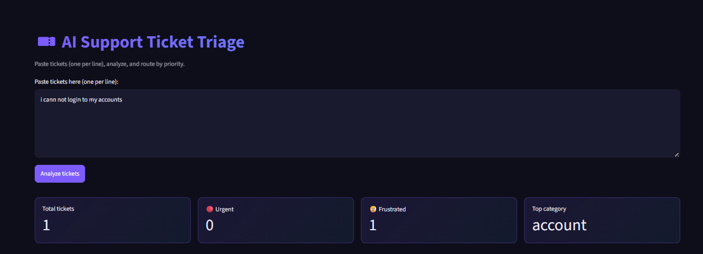
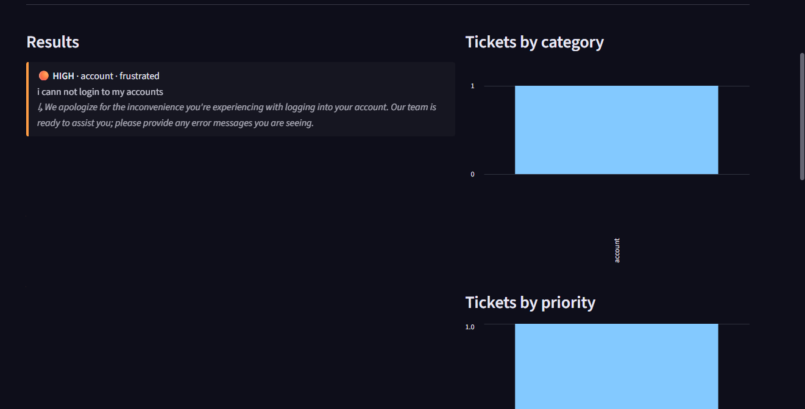
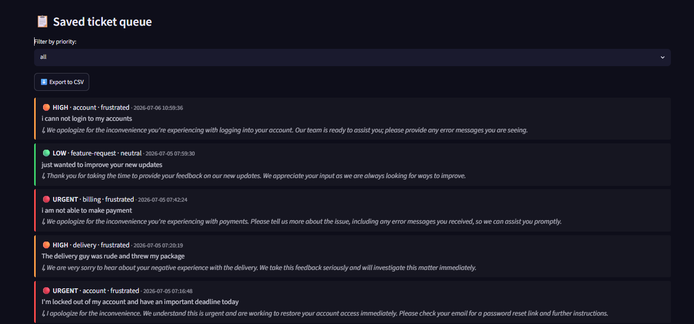
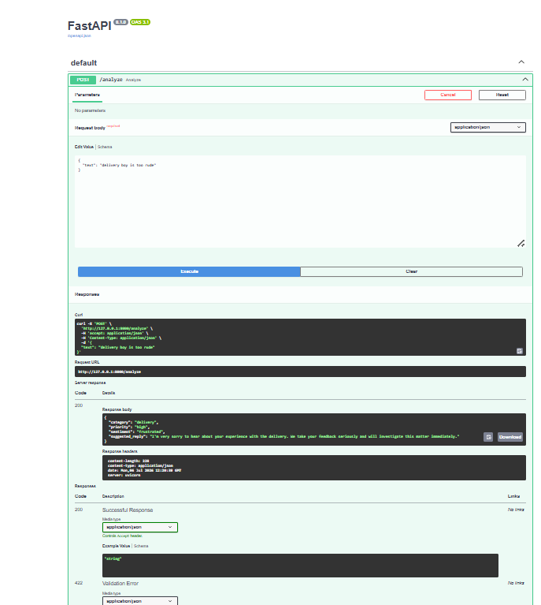

# 🎫 AI Support Ticket Triage System

An AI-powered tool that reads raw customer support tickets and automatically
classifies, prioritizes, and drafts a reply for each one: turning an
unsorted pile of complaints into an actionable, priority-sorted queue.

---

## Problem Statement

Support teams receive tickets in free-form text with no structure: a mix
of billing complaints, login issues, delivery problems, and positive
feedback, all dumped into one inbox. Sorting through these manually to
figure out **what's urgent**, **who should handle it**, and **how to reply**
is slow and inconsistent between agents.

This project solves that by using an LLM (Gemini 2.5 Flash) to read each
ticket and instantly return:

| Field | Example |
|---|---|
| **Category** | `delivery`, `billing`, `technical`, `account`, `feature-request` |
| **Priority** | `urgent`, `high`, `medium`, `low` |
| **Sentiment** | `frustrated`, `neutral`, `satisfied` |
| **Suggested reply** | A short, ready-to-send draft response |

Results are stored in a database and shown in a **priority-sorted queue**
(urgent tickets always float to the top), mirroring how a real support tool
like Zendesk or Freshdesk routes tickets: instead of just passively
summarizing feedback.

---

## Why this is more than a basic "review analyzer"

| | Basic review analyzer | This project |
|---|---|---|
| Output | label, score, theme | category, priority, sentiment, **suggested reply** |
| Purpose | passive summary | **actionable routing**: what to do, and how urgently |
| Dashboard | stats only | filterable **priority queue**, sorted like a real agent inbox |
| Reliability | none | **retries** on rate limits/server errors, input validation |
| Accuracy | unverified | measured with a **golden-set evaluation script** |

---

## Tech Stack

| Layer | Technology | Why |
|---|---|---|
| Language | Python 3.12+ | |
| Package manager | **uv** | fast, modern dependency management |
| LLM | **Gemini 2.5 Flash** (`google-genai`) | free tier, fast, supports structured output |
| Structured output | **Pydantic** | forces the LLM to return clean, typed JSON: no fragile text parsing |
| Backend | **FastAPI** | serves the `/analyze` endpoint |
| Frontend | **Streamlit** | dashboard: paste tickets, view queue, filter by priority |
| Database | **SQLite** | stores every analyzed ticket for the persistent queue |
| Concurrency | **ThreadPoolExecutor** | analyzes multiple tickets in parallel instead of one-by-one |
| Evaluation | Custom golden-set script (`eval.py`) | measures classification accuracy, not just "does it run" |

No paid API key is required: Gemini's free tier is enough for this project's scope.

---

## File Structure

```
ticket_triage/
├── api.py                 # FastAPI backend: calls Gemini, handles retries/errors
├── app.py                 # Streamlit frontend: input, results, priority queue, charts
├── database.py             # SQLite: save analyzed tickets, load/filter saved queue
├── eval.py                 # Evaluation script: tests accuracy against 8 labeled tickets
├── sample_tickets.txt      # Ready-made tickets for quickly testing the app
├── pyproject.toml          # Dependencies (used by uv)
├── requirements.txt        # Same dependencies, for pip users
├── sample.env              # Template for your API key: copy to .env
├── .streamlit/
│   └── config.toml         # Dashboard theme (dark, blue/purple accents)
└── README.md
```

**How the pieces connect:**
```
User pastes tickets
        │
        ▼
   app.py (Streamlit)  ──POST /analyze──▶  api.py (FastAPI)  ──▶  Gemini 2.5 Flash
        │                                        │
        │                                        ▼
        │                              Pydantic validates the
        │                              structured JSON response
        ▼                                        │
  Priority queue,             ◀──────────────────┘
  charts, CSV export
        │
        ▼
   database.py (SQLite): auto-saves every analyzed ticket
```

`eval.py` talks directly to `api.py` (same `/analyze` endpoint the UI uses),
so it tests the exact same code path a real user hits: not a separate
mock.

---

## Setup

```bash
uv sync
```

Copy `sample.env` to `.env` and add your free Gemini key
(get one at https://aistudio.google.com: no credit card needed):

```
GOOGLE_API_KEY=your_key_here
```

> **Free tier note:** Gemini 2.5 Flash's free tier allows a limited number
> of requests per day (currently 20 on a new project). This project batches
> and retries requests carefully, but heavy testing in a single day can
> still hit that daily cap: if so, just wait for the next day's reset or
> use a fresh API key from a new Google Cloud project.

---

## Run (two terminals)

**Terminal 1: backend:**
```bash
uv run fastapi dev api.py
```
Test it directly at http://127.0.0.1:8000/docs

**Terminal 2: frontend:**
```bash
uv run streamlit run app.py
```

Paste a few lines from `sample_tickets.txt` into the text box and click
**Analyze tickets**. Results are auto-saved: no extra "save" step needed.

---

## Evaluating model accuracy

Instead of just trusting the LLM's output, `eval.py` checks it against a
small **golden set**: 8 tickets where the correct category/priority/
sentiment is already known. This is standard practice in real ML systems:
whenever you change the prompt, you re-run the eval to make sure you didn't
accidentally make things worse.

With the backend running, in a separate terminal:
```bash
uv run python eval.py
```

You'll get a report like:
```
[1/8] Testing: My order #4521 hasn't arrived in 10 days, I need a...
  -> done
...
Category accuracy:  8/8 (100%)
Priority accuracy:  6/8 (75%)
Sentiment accuracy: 8/8 (100%)
```

Any mismatches are printed with full detail, so you can see exactly which
ticket the model got wrong and iterate on the prompt in `api.py`.

**Note on priority accuracy:** "Urgent" vs "high" is a genuinely fuzzy
boundary (e.g. is a 10-day-late delivery "urgent" or just "high"?). Don't
chase 100% on a tiny 8-example set: that leads to overfitting the prompt
to those specific examples. A reasonable, documented accuracy with clear
reasoning about edge cases is more realistic than a perfect score.

---

## Known limitations (be upfront about these)

- **Scope is intentionally small**: this is a foundational/learning
  project, not a production system. No auth, no multi-user support.
- **SQLite** works for a single-user demo but wouldn't scale to a real
  multi-agent support team (would need PostgreSQL + proper locking).
- **Streamlit UI** is a fast prototype tool, not a production frontend:
  fine for a portfolio demo, not meant to be a polished customer-facing app.
- **Free-tier rate limits** mean this isn't ready for real traffic without
  enabling billing on the Gemini API.

---


## Screenshots

**Dashboard: paste tickets and analyze**


**Analysis results: priority-sorted cards with metrics and charts**


**Saved ticket queue: filterable by priority**


**Backend API docs (FastAPI auto-generated)**


---

## Contact

Rajeev Kumar

- LinkedIn: [https://www.linkedin.com/in/rajeev245/](https://www.linkedin.com/in/rajeev245/)
- GitHub: [https://github.com/21f3001527](https://github.com/21f3001527)
- Email: [rajeev90767@gmail.com](mailto:rajeev90767@gmail.com)
